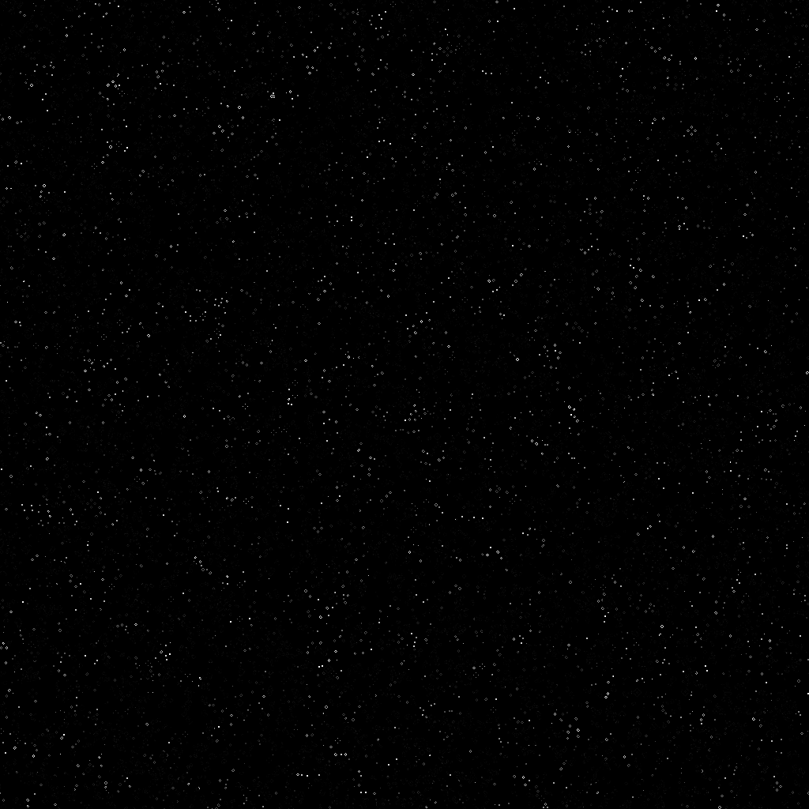
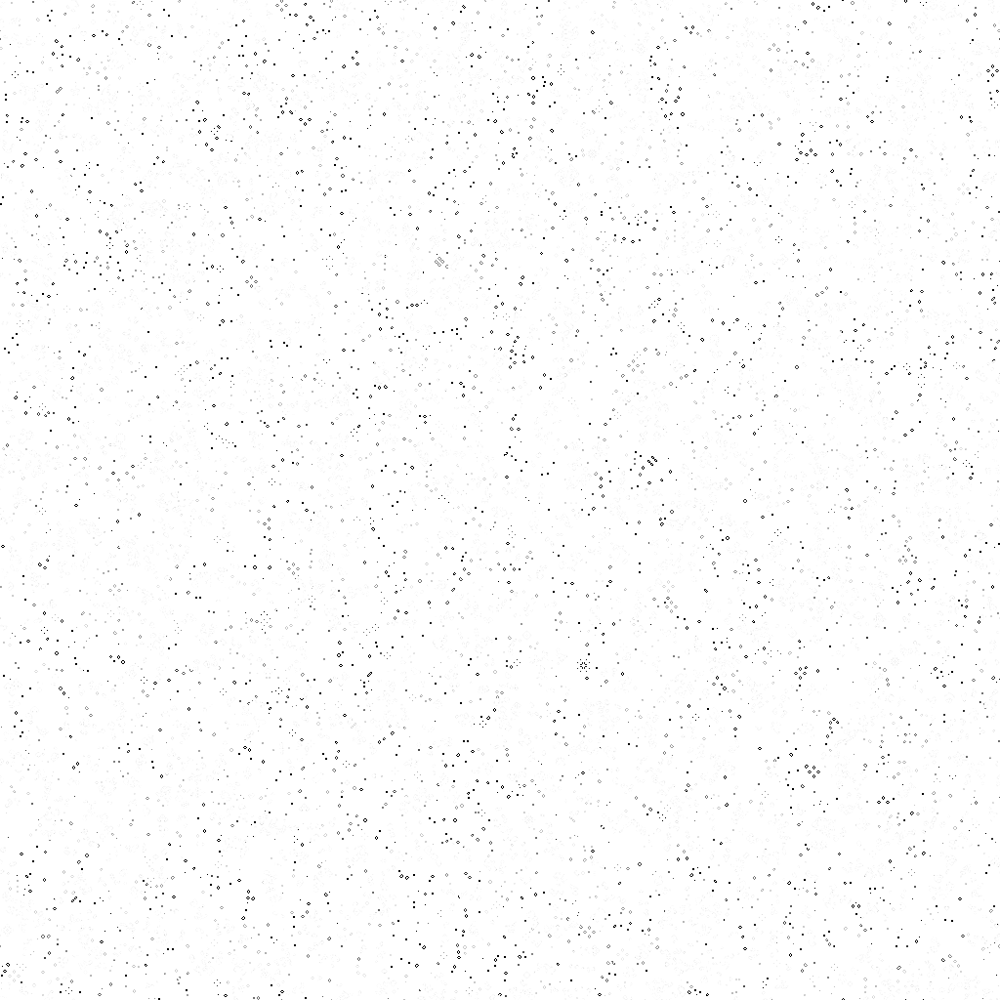
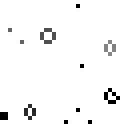

# game_of_life.cl
OpenCL implementation of Conway's Game of Life, tracks lifetime of cell in opacity.

## Output

Running 200 iterations on a 1024x1024 board.

Example of output, convertd from PGM to PNG format.

You can also invert output.

Close up

## Performance
13.3 seconds on AMD Ryzen 5 2600 (7680 x 4320, 200 iterations).
0.45 seconds on AMD Radeon 5500 XT 8GB (7680 x 4320, 200 iterations).
